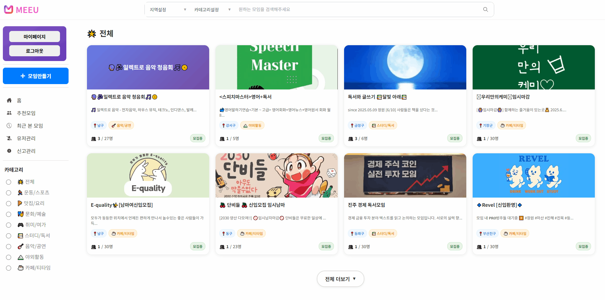

# 🤝 NoMore

**관심사와 지역을 기반으로 사람들을 연결하는 모임 매칭 플랫폼**

 

🔗 **배포 URL** :
🧪 **Test ID** :  
🔑 **Test PW** : 

 

## 📌 프로젝트 소개

- **NoMore**는 혼자서는 시작하기 어려운 활동들을 함께할 사람들을 쉽게 찾을 수 있도록 돕는 지역 기반 모임 매칭 플랫폼입니다.
- 개인의 관심사를 기반으로 맞춤형 모임을 추천하고, 실시간 채팅을 통해 자연스러운 커뮤니티 형성을 지원합니다.
- 다양한 카테고리의 모임을 탐색하고 직접 모임을 개설하여 새로운 인연을 만들 수 있습니다.
- 관리자 페이지를 통해 효율적인 커뮤니티 관리와 사용자 지원이 가능합니다.

 

## 👥 팀원 구성

| **팀장 김규철** | **팀원 김재원** | **팀원 김대웅** | **팀원 이진혁** |
| :-------------: | :-------------: | :-------------: | :-------------: |
| [김규철](https://github.com/kimkyuchul0728) | [김재원](https://github.com/jaewon112) | [김대웅](https://github.com/Deaung) | [이진혁](https://github.com/jin9358) |

 

## 🛠️ 기술 스택

### ⚡ Frontend
- **Language**: JavaScript (ES6+)
- **Framework/Library**: React 18
- **State**: Zustand, TanStack React Query
- **Styling** : Emotion (CSS-in-JS)
- **UI Library** : Material-UI
- **Build Tool** : Vite

### ⚙️ Backend  
- **Language** : Java 17
- **Framework** : Spring Boot 3.5.4
- **Web** : Spring Web
- **Security** : Spring Security, JWT, OAuth2
- **Database** : MySQL 8.0, MyBatis
- **API Documentation** : Swagger

 

## 📋 주요 기능

### 🔐 **인증 시스템**
- OAuth2 소셜 로그인 (Google, Kakao)
- JWT 기반 토큰 인증
- 사용자 권한 관리 (USER, ADMIN)

### 🏠 **모임 탐색**
- 지역/카테고리/키워드 통합 검색
- 관심사 기반 맞춤 추천 알고리즘
- 실시간 모임 현황 (참여인원/모집상태)

### 💬 **소셜 기능**  
- 모임별 실시간 채팅
- 게시판 및 댓글 시스템
- 좋아요 기능

### 🛠️ **관리자 기능**
- 사용자/모임/게시글 관리
- 신고 처리 시스템
- 실시간 통계 대시보드
- 권한 및 상태 관리

 

## 📁 프로젝트 구조

### 🎨 Frontend (nomore_front)

---

## 📱 기능 설명

### 🔐 로그인 & 로그아웃
   
OAuth2(Google, Kakao) 기반 로그인 기능을 제공합니다.

JWT 토큰을 만료시켜 로그아웃을 처리합니다.

---

### 👤 마이페이지
  
프로필 정보 수정, 관심 카테고리 변경, 내가 참여한 모임/작성한 게시글 확인이 가능합니다.

---

### 🏠 추천 모임 화면
  
사용자 관심사를 기반으로 추천 모임을 제공합니다.

  
mypage에서 내가 원하는 카테고리를 선택할 수 있습니다.

---

### 🕒 최근 본 모임
  
사용자가 열람했던 모임을 로컬에 기록해 빠르게 다시 접근할 수 있습니다.

---

### 🛠️ 사용자 관리 (관리자 페이지)
  
관리자는 회원 리스트를 조회하고 상태(활성/정지)를 변경할 수 있습니다.

  
관리자 대시보드에서 전체 사용자, 모임, 게시글을 모니터링할 수 있습니다.

---

### 📄 전체 페이지 구성
  
서비스의 주요 페이지(홈, 모임 탐색, 채팅, 마이페이지)를 연결해 전체 흐름을 확인할 수 있습니다.

---

### 🔍 모임 검색
  
키워드와 카테고리/지역 필터를 적용하여 원하는 모임을 빠르게 찾을 수 있습니다.

---

### ✏️ 모임 생성
  
사용자가 직접 새로운 모임을 개설하고 기본 정보를 입력할 수 있습니다.

---

### 📌 게시판 기능
  
모임별 게시판을 통해 게시글 작성, 댓글 작성, 좋아요 기능을 제공합니다.

---

### 💬 실시간 채팅
  
WebSocket 기반으로 모임원 간 실시간 메시지·이미지 공유가 가능합니다.

---